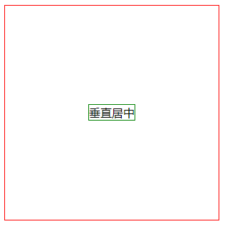
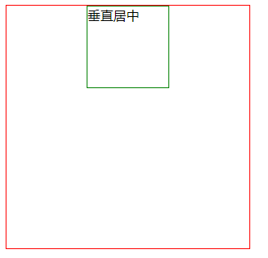
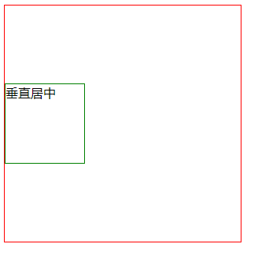
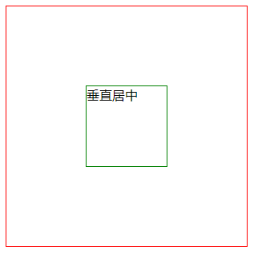
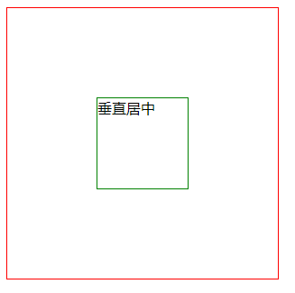

### 一、html代码

    

        
垂直居中

    

### 二、css代码

通过添加边框来让元素更方便查看：  

    .parent {
        width: 300px;
        height: 300px;
        border: 1px solid red;
    }
    .child {
        width: 100px;
        height: 100px;
        border: 1px solid green;
    }

##### （1）对于inline元素，设置line-height等于height来实现垂直居中，text-align: center来实现元素水平居中。

    .parent {
        text-align: center;
        line-height: 300px;
        height: 300px;
    }
    .child {
        display: inline;
    }
  

 
##### （2）对于block元素，设置margin: 0 atuo 来实现元素水平居中：

    .child {
        margin: 0 auto;
    }
  
  

也可通过设置margin: auto 0 来实现元素垂直，但是需要满足条件：绝对定位、高度固定

    .parent {
        position: relative;
    }
    .child {
        position: absolute;
        top: 0;
        bottom: 0; 
        margin: auto 0;
    }
  

 
 ##### （3）通过绝对定位来实现水平和垂直居中
 
设置css3属性translate，让元素top、left为50%，在通过translate来上移或左移元素宽高的一半来实现水平和垂直居中：

    .parent {
        position: relative;
    }
    .child {
        position: absolute;
        left: 50%;
        top: 50%;
        transform: translateX(-50%) translateY(-50%);
    }

同时，也可使用margin-left和margin-top来代替translate上移或左移元素宽高的一半：

    .parent {
        position: relative;
    }
    .child {
        position: absolute;
        left: 50%;
        top: 50%;
        margin-left: -50px;
        margin-top: -50px;
    }

 ##### （4）弹性盒子flex

    .parent {
        display: flex;
        justify-content: center;
        align-items: center;
    }
 
