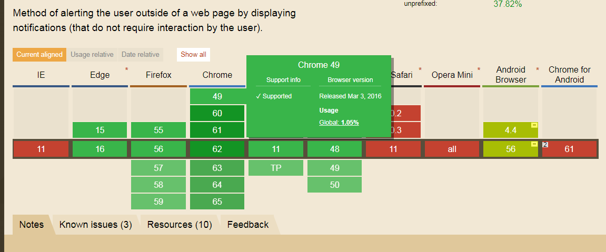
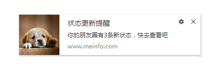
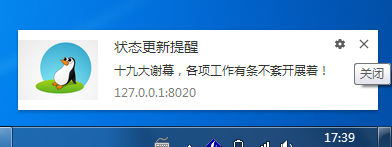

### H5桌面通知：Notification API

#### 参考网址
1  https://juejin.im/post/59ed37f5f265da431e15eaac   
2  https://developer.mozilla.org/en-US/docs/Web/API/notification

#### 前言

Notification API 是 HTML5 新增的桌面通知 API，用于向用户显示通知信息。该通知是脱离浏览器的，即使用户没有停留在当前标签页，甚至最小化了浏览器，该通知信息也一样会置顶显示出来。

#### 兼容

说到兼容，自然是倒下一大片，而且各浏览器的表现也会有点差异。移动端的几乎全倒，PC端的还好大多都能支持，除了IE。所以使用前，需要先检查一下浏览器是否支持 Notification。

#### 用户权限

想要向用户显示通知消息，需要获取用户权限，而相同的域名只需要获取一次权限。只有用户允许的权限下，Notification 才能起到作用，避免某些网站的广告滥用 Notification 或其它给用户造成影响。那么如何知道用户到底是允不允许的？

`Notification.permission` 该属性用于表明当前通知显示的授权状态，可能的值包括：  
* default ：不知道用户的选择，默认。
* granted ：用户允许。
* denied ：用户拒绝。

    if(Notification.permission === 'granted'){
        console.log('用户允许通知');
    }else if(Notification.permission === 'denied'){
        console.log('用户拒绝通知');
    }else{
        console.log('用户还没选择，去向用户申请权限吧');
    }

#### 请求权限

当用户还没选择的时候，我们需要向用户去请求权限。Notification 对象提供了 `requestPermission()` 方法请求用户当前来源的权限以显示通知。

以前基于回调的语法已经弃用（当然在现在的浏览器中还是能用的），最新的规范已将此方法更新为基于 promise 的语法：

    Notification.requestPermission().then(function(permission) {
        if(permission === 'granted'){
            console.log('用户允许通知');
        }else if(permission === 'denied'){
            console.log('用户拒绝通知');
        }
    });

#### 推送通知

获取用户授权之后，就可以推送通知了。
var notification = new Notification(title, options)

###### 参数如下：
* title：通知的标题
* options：通知的设置选项（可选）。
    - body：通知的内容。
    - tag：代表通知的一个识别标签，相同tag时只会打开同一个通知窗口。
    - icon：要在通知中显示的图标的URL。
    - image：要在通知中显示的图像的URL。
    - data：想要和通知关联的任务类型的数据。
    - requireInteraction：通知保持有效不自动关闭，默认为false。

还有一些其他的参数，因为用不了或者没什么用这里就没必要说了

    var n = new Notification('状态更新提醒',{
        body: '你的朋友圈有3条新状态，快去查看吧',
        tag: 'linxin',
        icon: 'http://blog.gdfengshuo.com/images/avatar.jpg',
        requireInteraction: true
    })

通知消息的效果图如下：

 
#### 关闭通知

从上面的参数可以看出，并没有一个参数用来配置显示时长的。我想要它 3s 后自动关闭的话，这时可以调用 `close()` 方法来关闭通知。

    var n = new Notification('状态更新提醒',{
        body: '你的朋友圈有3条新状态，快去查看吧'
    })

    setTimeout(function() {
        n.close();
    }, 3000);

 
#### 事件

Notification 接口的 `onclick`属性指定一个事件侦听器来接收 click 事件。当点击通知窗口时会触发相应事件，比如打开一个网址，引导用户回到自己的网站去。

    var n = new Notification('状态更新提醒',{
        body: '你的朋友圈有3条新状态，快去查看吧',
        data: {
            url: 'http://blog.gdfengshuo.com'
        }
    })
    n.onclick = function(){
        window.open(n.data.url, '_blank');      // 打开网址
        n.close();                              // 并且关闭通知
    }

 
#### 应用场景

前面说那么多，其实就是为了用。那么到底哪些地方可以用到呢？

现在网站的消息提醒，大多数都是在消息中心显示个消息数量，然后发邮件告诉用户，这流程完全没有错。不过像我这种用户，觉得别人点个赞，收藏一下都要发个邮件提醒我，老是要去删邮件（强迫症），我是觉得挺烦的甚至关闭了邮件提醒。

当然这里并不是说要用 Notification，毕竟它和邮件的功能完全不一样。

我觉得比较适合的是==新闻网站==。用户浏览新闻时，可以推送给用户实时新闻。以腾讯体育为例，它就使用了 Notification API。在页面中引入了一个 notification2017_v0118.js，有兴趣可以看看别人是怎么成熟的使用的。

一进入页面，就获取授权，同时自己页面有个浮动框提示你允许授权。如果允许之后，就开始给你推送通知了。不过它在关闭标签卡的时候，通知也会被关闭，那是因为监听了页面 `beforeunload` 事件。

    function addOnBeforeUnload(e) {
        FERD_NavNotice.notification.close();
    }
    if(window.attachEvent){
        window.attachEvent('onbeforeunload', addOnBeforeUnload);
    } else {
        window.addEventListener('beforeunload', addOnBeforeUnload, false);
    }
